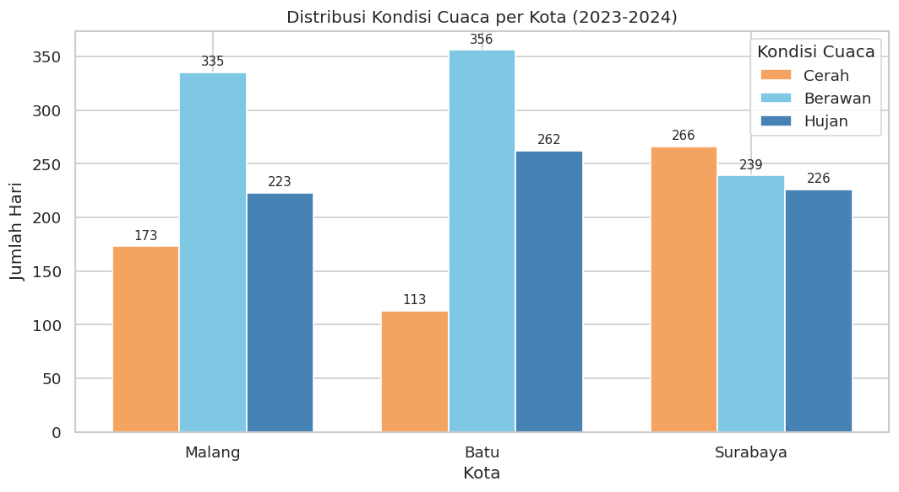
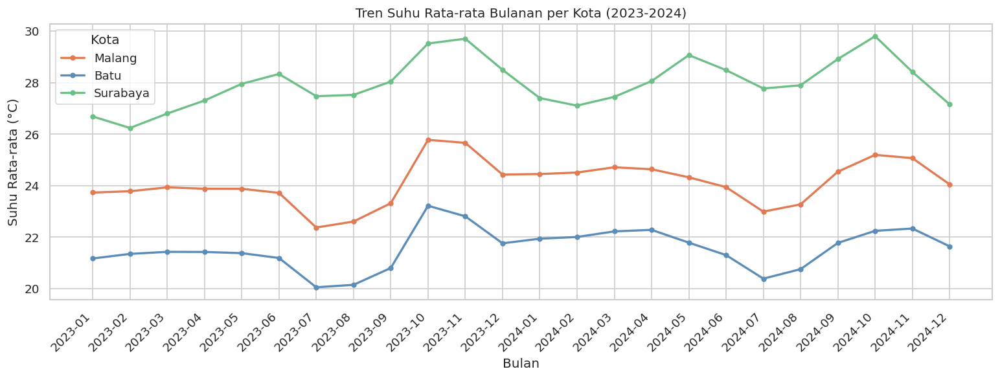
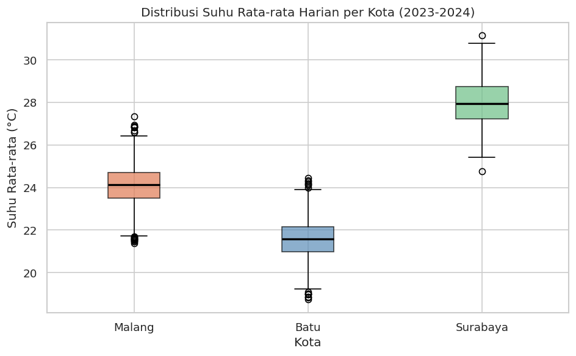
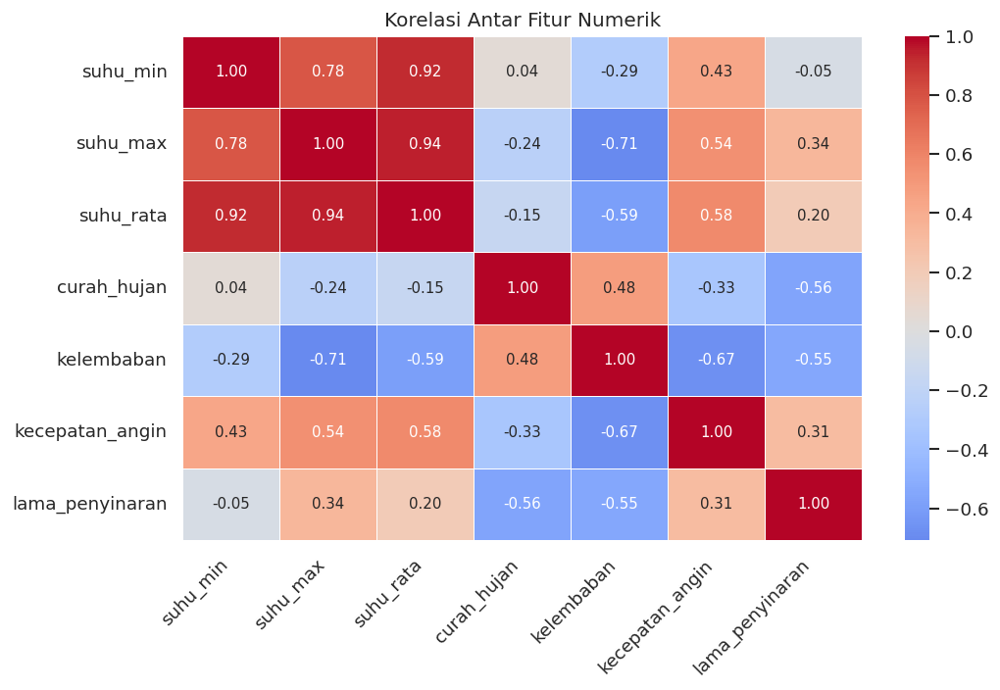

# Dataset Cuaca Tiga Kota Jawa Timur (2023-2024)

Dataset ini berisi data cuaca harian dari tiga kota di Jawa Timur, yaitu
Kota Malang, Kota Batu, dan Kota Surabaya, untuk rentang waktu 2023 sampai
2024. Dataset ini dikembangkan sebagai bagian dari tugas mata kuliah Machine
Learning dan dirancang untuk keperluan klasifikasi kondisi cuaca harian
menggunakan algoritma machine learning.

---

## Informasi Dataset

| Atribut | Keterangan |
|---|---|
| Sumber Data | Open-Meteo Historical Weather API (ERA5-Land, ECMWF) |
| Wilayah | Kota Malang, Kota Batu, Kota Surabaya |
| Rentang Waktu | 1 Januari 2023 sampai 31 Desember 2024 |
| Jumlah Baris | 2.193 baris |
| Jumlah Kolom | 10 kolom |
| Format | CSV |
| Lisensi | Creative Commons Attribution 4.0 (CC BY 4.0) |

---

## Latar Belakang

Kondisi cuaca berpengaruh langsung terhadap berbagai sektor kehidupan,
mulai dari pertanian, transportasi, pariwisata, hingga kesehatan masyarakat.
Ketiga kota yang dipilih mewakili karakteristik geografis yang berbeda di
Jawa Timur: Kota Batu berada di dataran tinggi pegunungan, Kota Malang di
dataran tinggi, dan Kota Surabaya di dataran rendah pesisir. Perbedaan ini
menghasilkan variasi data cuaca yang kaya dan representatif untuk keperluan
pemodelan.

Dataset ini dibuat untuk mengisi kekosongan dataset cuaca harian yang
berfokus secara spesifik pada wilayah Jawa Timur bagian tengah dan utara,
yang belum banyak tersedia secara publik dalam format terstruktur.

---

## Kamus Data

| Kolom | Tipe | Satuan | Deskripsi |
|---|---|---|---|
| tanggal | object | - | Tanggal pengamatan (format YYYY-MM-DD) |
| kota | object | - | Nama kota: Malang, Batu, atau Surabaya |
| suhu_min | float64 | °C | Suhu udara terendah dalam satu hari |
| suhu_max | float64 | °C | Suhu udara tertinggi dalam satu hari |
| suhu_rata | float64 | °C | Rata-rata suhu udara sepanjang hari |
| curah_hujan | float64 | mm | Total curah hujan dalam satu hari |
| kelembaban | float64 | % | Rata-rata kelembaban udara relatif |
| kecepatan_angin | float64 | km/jam | Rata-rata kecepatan angin |
| lama_penyinaran | float64 | jam | Durasi sinar matahari dalam satu hari |
| kondisi_cuaca | object | - | Label: Cerah, Berawan, atau Hujan |

### Aturan Pelabelan kondisi_cuaca

Label kondisi cuaca diturunkan dari nilai curah hujan harian:

- **Cerah**: curah_hujan = 0 mm
- **Berawan**: curah_hujan lebih dari 0 mm dan kurang dari atau sama dengan 5 mm
- **Hujan**: curah_hujan lebih dari 5 mm

---

## Visualisasi

### Distribusi Kondisi Cuaca per Kota


### Tren Suhu Rata-rata Bulanan per Kota


### Distribusi Suhu Rata-rata Harian per Kota


### Korelasi Antar Fitur Numerik


---

## Struktur Repositori
dataset-cuaca-jawa-timur/
├── data/
│ └── dataset_cuaca_tiga_kota_jatim.csv
├── images/
│ ├── grafik_1_distribusi_kondisi_cuaca.png
│ ├── grafik_2_tren_suhu_bulanan.png
│ ├── grafik_3_boxplot_suhu.png
│ └── grafik_4_heatmap_korelasi.png
├── notebook/
│ └── Dataset_Cuaca_Tiga_Kota_Jawa_Timur.ipynb
└── README.md


---

## Cara Menggunakan Dataset

```python
import pandas as pd

df = pd.read_csv("data/dataset_cuaca_tiga_kota_jatim.csv")
print(df.head())
```

Dataset dapat langsung digunakan untuk keperluan klasifikasi dengan
menggunakan kolom kondisi_cuaca sebagai label target dan kolom numerik
lainnya sebagai fitur.

---

## Keterbatasan Dataset

- Data merupakan hasil reanalysis ERA5-Land, bukan pengamatan langsung
  dari stasiun meteorologi.
- Cakupan terbatas pada tiga kota dan belum dapat digeneralisasi ke
  seluruh wilayah Jawa Timur.
- Label kondisi_cuaca diturunkan dari curah hujan dan tidak
  mempertimbangkan faktor lain seperti tutupan awan aktual.
- Rentang waktu dua tahun belum cukup untuk analisis tren iklim
  jangka panjang.

---

## Sumber Data dan Referensi

Hersbach, H., et al. (2020). The ERA5 global reanalysis. *Quarterly
Journal of the Royal Meteorological Society*, 146(730), 1999-2049.
https://doi.org/10.1002/qj.3803

Munoz-Sabater, J., et al. (2021). ERA5-Land: A state-of-the-art global
reanalysis dataset for land applications. *Earth System Science Data*,
13(9), 4349-4383. https://doi.org/10.5194/essd-13-4349-2021

Zippenfenig, P. (2023). Open-Meteo.com Weather API. Zenodo.
https://doi.org/10.5281/zenodo.7970649

Badan Pusat Statistik. (2024). Data wilayah administrasi kota di
Jawa Timur. https://www.bps.go.id

---

## Pembuat

**Muhammad Iqbal Fadel**
Universitas Muhammadiyah Malang
Machine Learning / C
2026